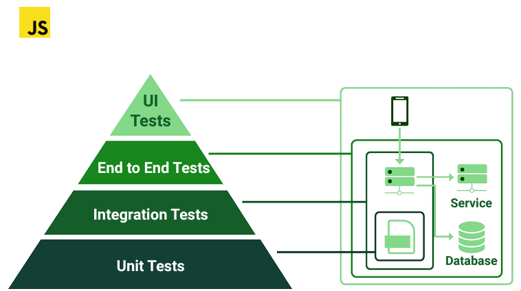
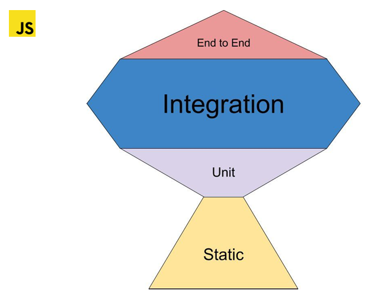
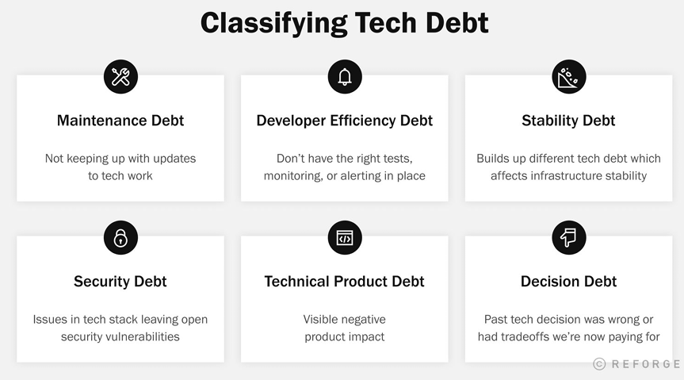
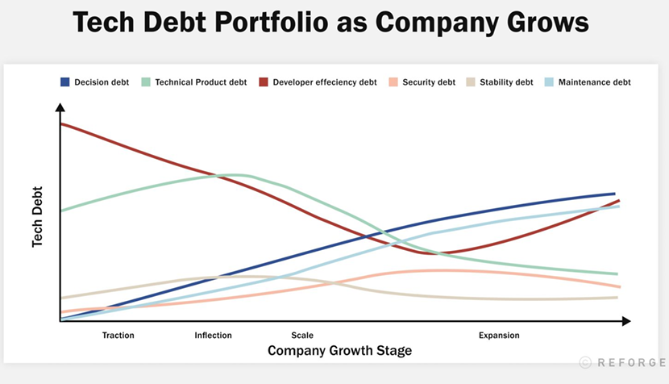
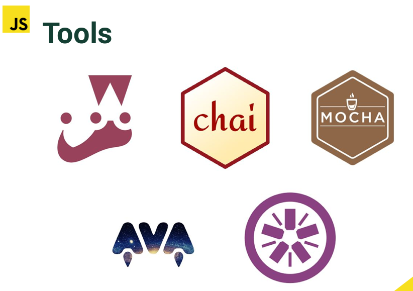
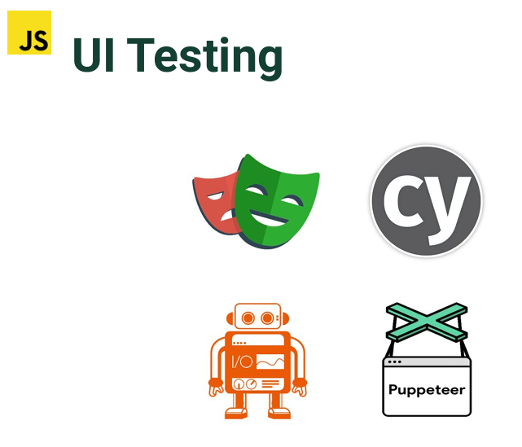
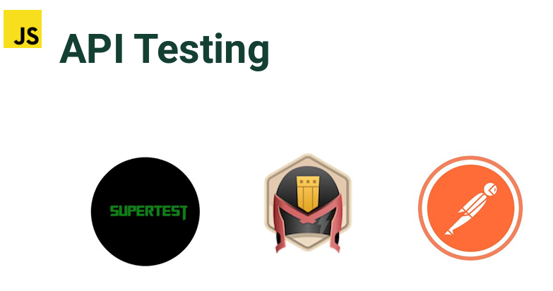
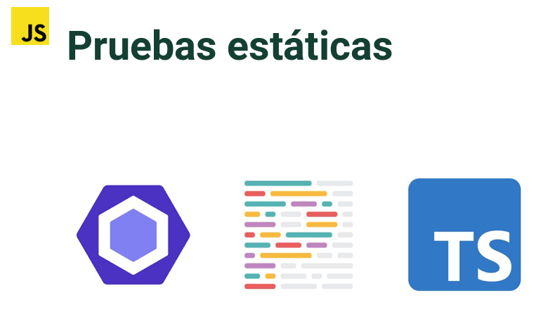
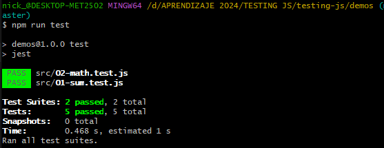

# INTRODUCCION

## 1. ¿Que es testing?

El testing de software es un proceso crucial en el desarrollo de aplicaciones, diseñado para evaluar y mejorar la calidad del software. A continuación, se detallan los conceptos clave que has mencionado y otros aspectos importantes:

**Fases del ciclo de vida del software y testing**

- Diseño: En esta fase, se identifican los requerimientos y se planifica cómo serán probados. Las pruebas están orientadas a validar si el diseño cumple con las especificaciones.
- Desarrollo: Durante el desarrollo, se pueden realizar pruebas unitarias para verificar el correcto funcionamiento de componentes individuales.
- Pruebas (Testing): Aquí se realizan pruebas más exhaustivas, incluyendo pruebas de integración, de sistema y de aceptación, para asegurar que el software cumpla con los requerimientos y funcione correctamente en diferentes escenarios.
- Producción: Aunque el software ya está en uso, se sigue monitorizando y probando para identificar y corregir posibles errores.

Cuanto antes se encuentre un error, más fácil es corregirlo. Esto es esencial porque el costo de corregir errores aumenta significativamente en etapas posteriores del desarrollo.

El testing no garantiza un software sin errores, sino que ayuda a identificar y mitigar riesgos. El objetivo es encontrar problemas y asegurarse de que el software sea suficientemente robusto para el uso previsto.

**Capas de testing**

**Análisis Estático:** Se realiza sin ejecutar el código. Incluye técnicas como la revisión de código y el uso de herramientas que analizan el código fuente para encontrar errores potenciales, como typos o llamadas incorrectas a funciones.

**Pruebas Unitarias:** Son pruebas automáticas que verifican la funcionalidad de unidades de código individuales (como funciones o métodos). Ayudan a asegurarse de que cada componente funcione según lo esperado.

**Pruebas de Integración:** Estas pruebas verifican la interacción entre diferentes componentes del sistema. Aseguran que los módulos funcionen bien juntos y que los datos se pasen correctamente entre ellos.

**Revisión de Código:** Es un proceso manual donde otros desarrolladores revisan el código para asegurar que cumple con los estándares de calidad y prácticas del equipo.

**Aseguramiento de Calidad (QA):** Incluye una gama de actividades, desde pruebas manuales hasta pruebas automatizadas, para asegurar que el software cumple con los requisitos funcionales y no funcionales. QA también puede incluir pruebas de rendimiento, seguridad y usabilidad.

## 2. La piramide del testing





Las imágenes muestran dos representaciones de la pirámide de pruebas en el desarrollo de software, un modelo que ayuda a organizar los diferentes niveles de pruebas automáticas y manuales. La pirámide es una estrategia efectiva para maximizar la cobertura de pruebas mientras se minimizan los esfuerzos y los costos.

**Detalles de la Pirámide de Pruebas**

**1. Pruebas Unitarias (Base de la pirámide)**: Son las más rápidas y menos costosas de escribir y mantener. Se centran en la menor unidad de software, como funciones o métodos. Ayudan a asegurar que cada parte del sistema funcione correctamente por separado.

**2. Pruebas de Componentes/Integración (Medio de la pirámide):** Verifican la interacción entre varios componentes o sistemas para asegurar que funcionen juntos como se espera. Son más lentas y costosas que las pruebas unitarias, pero menos que las pruebas de extremo a extremo. 

**3. Pruebas de API y de Integración Automatizadas:** Estas pruebas suelen ser consideradas como un subconjunto dentro de las pruebas de integración.
Prueban las interfaces y la integración de diferentes módulos o servicios externos.

**4. Pruebas de extremo a extremo (E2E) (Cima de la pirámide):** Son las más lentas y costosas. Simulan el comportamiento del usuario para verificar que el sistema completo funcione como se espera en un entorno que imita la producción.

**5. Pruebas Manuales y Exploratorias (Cima, exterior de la pirámide en la primera imagen):** Involucran la interacción humana para detectar errores que no se captan fácilmente con pruebas automatizadas.
Son críticas porque simulan la experiencia real del usuario y pueden descubrir problemas inesperados.

**Comparación de las Representaciones**

La primera imagen, que presenta la "Pirámide Ideal de Pruebas de Software", incluye pruebas manuales y exploratorias en la cúspide, sugiriendo que estas pruebas, aunque importantes, deben ser menos frecuentes comparadas con las pruebas automatizadas.

La segunda imagen (trofeo) muestra un modelo invertido, comenzando con pruebas estáticas en la base (como análisis de código), seguido por pruebas unitarias, de integración y finalmente de extremo a extremo.

Ambas representaciones destacan la importancia de un enfoque balanceado y estratificado para las pruebas de software, priorizando pruebas automatizadas rápidas y eficientes mientras se reserva la intervención manual para escenarios más complejos y críticos.

## 3. Hablemos sobre deuda técnica

La deuda técnica es un concepto en el desarrollo de software que refleja el costo extra de rehacer el trabajo debido a la elección de una solución fácil y rápida en lugar de usar un enfoque más adecuado que podría tardar más tiempo. La deuda técnica puede acumularse si no se gestiona adecuadamente, llevando a un código más difícil de mantener y a un mayor costo en futuras modificaciones.



Esta imagen clasifica la deuda técnica en seis categorías principales:

**1. Deuda de Mantenimiento:** Falta de actualizaciones y mantenimiento a la infraestructura tecnológica.

**2. Deuda de Eficiencia del Desarrollador:** Ausencia de pruebas adecuadas, monitoreo o alertas que aseguren el funcionamiento óptimo del desarrollo.

**3. Deuda de Estabilidad:** Decisiones que impactan negativamente en la estabilidad de la infraestructura tecnológica.

**4. Deuda de Producto Técnico:** Impactos negativos visibles en el producto debido a deficiencias técnicas.

**5. Deuda de Seguridad:** Vulnerabilidades en la pila tecnológica que dejan abiertos riesgos de seguridad.

**6. Deuda de Decisión:** Costos resultantes de decisiones tecnológicas pasadas que resultaron ser inadecuadas o que involucraron compromisos.

Estas categorías ayudan a identificar y priorizar áreas críticas donde la deuda técnica puede tener un impacto significativo, facilitando la gestión y mitigación eficaz de los riesgos asociados.



Esta gráfica muestra cómo diferentes tipos de deuda técnica evolucionan a lo largo de las etapas de crecimiento de una empresa:

- **Etapa de Tracción:** Inicio del negocio donde la deuda de decisión y la deuda de producto técnico pueden ser más altas debido a decisiones rápidas para ganar mercado.
- **Punto de Inflexión:** Momento donde se revisan las decisiones iniciales y se hacen ajustes, posiblemente reduciendo la deuda de decisión pero aumentando la deuda de mantenimiento y seguridad al escalar.
- **Etapa de Escala:** Ampliación del negocio donde se optimizan procesos y se reduce la deuda en algunas áreas mientras que otras, como la deuda de seguridad, pueden crecer si no se gestionan adecuadamente.
- **Etapa de Expansión:** Expansión continua donde se intenta mantener un balance en la gestión de todas las formas de deuda técnica para evitar impactos negativos significativos en el negocio.

## 4. Herramientas de testing



**Herramientas Generales de Testing**

- Jest: Un marco de pruebas para JavaScript que se centra en la simplicidad y el soporte para grandes aplicaciones web.
- Chai: Una biblioteca de aserciones que se puede emparejar con cualquier marco de pruebas en JavaScript.
- Mocha: Un marco de pruebas flexible para Node.js y el navegador, que facilita las pruebas asíncronas.
- AVA: Un marco de pruebas moderno para JavaScript que permite pruebas concurrentes, lo que lo hace muy rápido.



**Herramientas de Testing de UI**

- Jest (Puppets): Utilizado aquí para representar pruebas que pueden involucrar simulaciones de interacciones de usuarios en un entorno de navegador, comúnmente con la ayuda de Puppeteer.
- Cypress: Un marco de pruebas de extremo a extremo que permite realizar pruebas de aplicaciones web de manera más eficiente y con menos configuración.
- Puppeteer: Una biblioteca que proporciona una API de alto nivel para controlar Chrome o Chromium sobre el protocolo DevTools, ideal para pruebas de rendimiento, pruebas de renderizado y más.



**Herramientas de Testing de API**

- Supertest: Facilita las pruebas de interfaces de programación de aplicaciones (APIs) HTTP en Node.js, emparejándose a menudo con frameworks como Express.
- Postman: Una plataforma muy conocida para el desarrollo de API que permite diseñar, simular, debuggear y testear APIs.
- SoapUI: Una herramienta para probar servicios web y APIs, soportando tanto REST como SOAP.



**Herramientas para Pruebas Estáticas**

- ESLint: Una herramienta de linting para JavaScript y JSX que ayuda a encontrar y corregir problemas en el código.
- SonarQube: Analiza el código fuente para detectar bugs, vulnerabilidades y malos olores en el código, ofreciendo informes detallados y guías de resolución.
- TypeScript: Más que una herramienta de prueba, es un superset de JavaScript que añade tipado estático, lo que puede ayudar a prevenir muchos tipos de errores antes de tiempo de ejecución.

## 5. Creando el proyecto

Para poder crear archivos para el gitignore usamos:

https://www.toptal.com/developers/gitignore/

Para el gitignore principal vamos a decir que ignore los archivos del sistema operativo window,macos, linux, copiamos y pegamos en el .gitignore

Luego creamos un archivo llamado .editorconfig y colocamos el siguiente contenido que se encuentra en: 

https://github.com/airbnb/javascript/blob/master/.editorconfig.

Luego, dentro de la carpeta demos inicializamos el proyect con el comando: npm init -y

El comando npm init -y se utiliza en Node.js para inicializar rápidamente un proyecto de Node y crear un archivo package.json con configuraciones predeterminadas.

Dentro de la carpeta demos creamos otro archivo .gitignore y colocamos el contenido que sale en la pagina de gitignore.io pero esta vez para "node".

Luego instalamos JEST: usamos npm install --save-dev jest en la terminal

Copiamos la prueba que nos proporciona JEST para ver si todo esta bien. Es importante que los archivos de prueba tenga la nomenclatura de test.js.

Por ultimo en el package.json en la parte de scripts ponemos:

"scripts": {
    "test": "jest"
  },

Entonces, para ejecutar las pruebas ponemos npm run test

```js
// Archivo 01-sum.js
function sum(a, b) {
  return a + b;
}
module.exports = sum;
```

```js
// Archivo 01-sum.test.js
const sum = require('./01-sum');

test('adds 1 + 2 to equal 3', () => {
  expect(sum(1, 2)).toBe(3);
});
```


## 6. Tu primer test

```js
// Archivo 02-math.js
function sum(a, b) {
  return a + b;
}

function multiply(a, b) {
  return a * b;
}

function divide(a, b) {
  if (b === 0) {
    return null;
  }
  return a / b;
}

module.exports = {
  sum,
  multiply,
  divide
};
```

```js
// Archivo 02-math.test.js
const { sum, multiply, divide } = require('./02-math');

test('adds 1 + 3 should be 4', () => {
  const rta = sum(1, 3);
  expect(rta).toBe(4);
});

test('should be 4', () => {
  const rta = multiply(1, 4);
  expect(rta).toBe(4);
});

test('should divide', () => {
  const rta = divide(6, 3);
  expect(rta).toBe(2);

  const rta2 = divide(5, 2);
  expect(rta2).toBe(2.5);
});

test('should divide', () => {
  const rta = divide(6, 0);
  expect(rta).toBeNull();

  const rta2 = divide(5, 0);
  expect(rta2).toBeNull();
});
```



